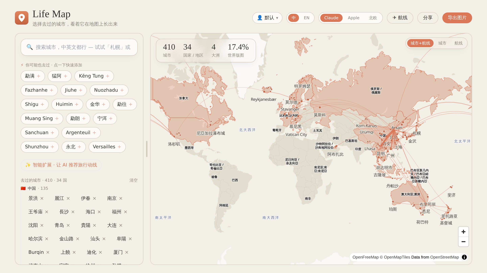

<div align="center">
  
  <h1>Life Map</h1>
  <p><strong>Chart the cities you've visited and the routes you've flown — on a map that's actually nice to look at.</strong></p>
</div>



Most "places I've been" tools are a list plus an ugly shaded map. Life Map aims to be the opposite: a tasteful, interactive world map where adding a city feels like autocomplete-with-momentum, your flights render as glowing great-circle arcs, and the result is a shareable poster.

## Features

- **Two-level world map** (MapLibre GL + OpenFreeMap vector tiles) — countries fill in; drill into a country to see its provinces and every city. Pan/zoom, multiple themes.
- **Flight map** — import your flight history and see every route as a great-circle arc (à la 航旅纵横). Toggle **cities + routes / cities only / routes only**, on screen and in the export.
- **Smart adding** — fuzzy bilingual search, instant local neighbor recommendations (precomputed), and an optional LLM "smart expand" for route/theme ideas.
- **Bilingual (中 / EN)** — every label switches, including the basemap place names and country names.
- **Shareable poster export** — render a 1:1 / 9:16 / 16:9 social image (2× resolution) with your stats and a title.
- **Per-user data** — pick a username; your map, custom places, and flights follow you (server-backed, no password yet).
- **航旅纵横 import** — upload the Excel export of your flown flights; airports are geocoded to cities automatically.

## Tech stack

`npm` workspaces monorepo:

- **`apps/web`** — Vite 5 + React 18 + TypeScript + Tailwind 3. MapLibre GL, MiniSearch, SheetJS (lazy).
- **`apps/api`** — Hono + `@hono/node-server` (run via `tsx`). SQLite persistence via `sql.js` (WASM).
- **`tools/`** — Python (stdlib + pandas) data pipeline building the bundled datasets from GeoNames / OpenFlights.

## Quick start

Requires **Node ≥ 18** and **Python 3** (only for rebuilding data).

```bash
npm install

# terminal 1 — API (port 3001)
npm run dev:api

# terminal 2 — web (port 5173, proxies /api → 3001)
npm run dev
```

Open http://localhost:5173. The bundled datasets are committed, so it runs out of the box — no Python or API key required.

### Production-ish

```bash
npm run build           # builds apps/web → apps/web/dist
./service.sh start      # builds web, starts API + `vite preview`, logs to ./logs
./service.sh status     # health + URLs   |   ./service.sh stop | restart | logs
```

## Configuration

Copy `.env.example` → `.env`. Everything is optional:

| Var | Purpose |
| --- | --- |
| `MINIMAX_API_KEY` / `MINIMAX_MODEL_NAME` | Enables the LLM "smart expand". Without it the app works fully; `/api/expand` just errors. |
| `PORT` / `HOST` | API bind (default `3001` / `0.0.0.0`). |
| `CORS_ORIGINS` | Comma-separated allowed origins in production. |

## Data pipeline

The bundled JSON in `apps/web/public/data/` is generated — committed so the app runs without the pipeline. To rebuild:

```bash
npm run data       # cities.json + neighbors.json from GeoNames cities5000
npm run flights    # flights.json + airports.json from flight.xls (your 航旅纵横 export) + OpenFlights
```

- `tools/build_data.py` — GeoNames `cities5000` → ~39k cities (deduped) with prominence, bilingual names, provinces; precomputed neighbor recommendations.
- `tools/build_flights.py` — maps Chinese airport names → IATA → OpenFlights coords → nearest prominent city; emits routes + a `zh-airport → city` map used by the in-app importer. Run with `--check` to validate before writing.

> `flight.xls` / `flight.jpg` are git-ignored (a raw itinerary contains ticket numbers); only the sanitized `flights.json` is committed.

## Project structure

```
apps/web/   React app (components/, hooks/, lib/, public/data/)
apps/api/   Hono API (map / places / flights / share / expand, SQLite store)
tools/      Python data builders
docs/       screenshots
service.sh  dev/prod process manager
```

## Architecture notes

- Country fills match by **ISO-numeric code** (each city carries `ccn`) to avoid coastline point-in-polygon misses; province fills use point-in-polygon. Antimeridian-crossing rings are unwrapped, and a country's fill is clipped to the sub-polygons near a visited city (so France doesn't light up French Guiana).
- Flight arcs are great circles (slerp + longitude unwrap) drawn as themed glowing lines, weighted by how often a route was flown.
- The LLM is a deliberately **server-side, cached** lane (keyed by anchor city) — never on the interactive hot path; the local geo recsys stays instant.

## Roadmap / known limitations

- Real authentication (today usernames are unauthenticated buckets).
- sql.js rewrites the whole DB per write — fine for personal scale; swap for `better-sqlite3` / `node:sqlite` for many users.
- Chinese city-name quality from GeoNames is uneven; mobile polish and accessibility have room to grow.

## License

[Apache-2.0](LICENSE).
