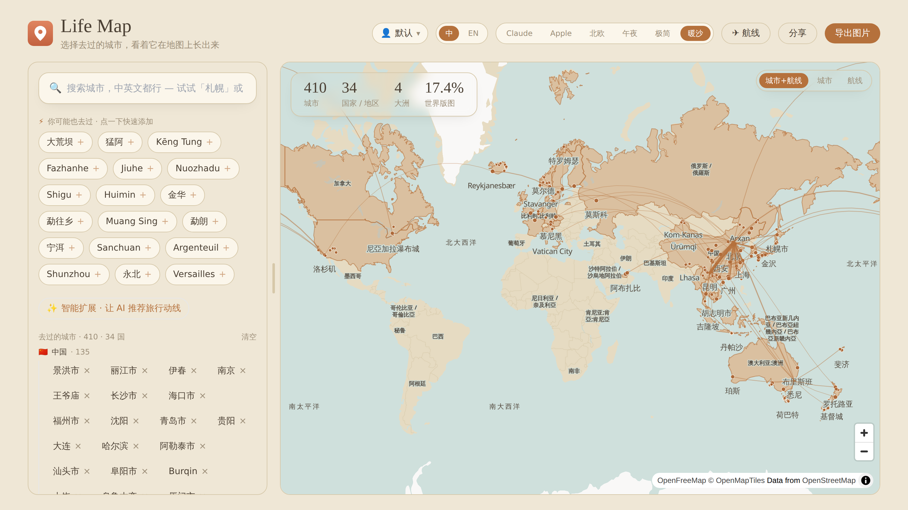

<div align="center">
  
  <h1>Life Map</h1>
  <p><strong>把你去过的城市和飞过的航线，画在一张真正好看的世界地图上。</strong></p>
  <p><a href="README.md">English</a> · <strong>中文</strong></p>
  <p>
    <a href="https://github.com/qhjqhj00/LifeMap/actions/workflows/ci.yml"></a>
    
    
  </p>
</div>



大多数「我去过哪些地方」的工具都是一份列表加一张丑陋的填色地图。Life Map 想反其道而行：一张可交互、好看的世界地图——添加城市像带惯性的自动补全，航线渲染成发光的大圆弧，最终还能导出可分享的海报。

## 功能

- **两级世界地图**（MapLibre GL + OpenFreeMap 矢量瓦片）——国家整体填色;点进一个国家可看到省份和每座城市。可缩放/平移,多套主题(含深色「午夜」)。
- **航线地图**——导入飞行记录,每条航线渲染成大圆弧(类似航旅纵横)。可三态切换 **城市+航线 / 仅城市 / 仅航线**,屏幕和导出图都支持。
- **智能添加**——中英文模糊搜索、即时的本地邻近城市推荐(预计算),以及可选的 LLM「智能扩展」给出动线/主题建议。
- **双语(中 / EN)**——所有文案随语言切换,包括底图地名和国家名。
- **可分享海报导出**——生成 1:1 / 9:16 / 16:9 的社媒图(2× 高清),带统计和标题。
- **按用户存储**——输入一个用户名,你的地图、自定义地点、航线都跟着走(服务端持久化,暂无密码)。
- **航旅纵横导入**——上传你的已飞航班 Excel 导出,机场自动地理编码到城市。

## 技术栈

`npm` workspaces 单仓多包:

- **`apps/web`**——Vite 5 + React 18 + TypeScript + Tailwind 3。MapLibre GL、MiniSearch、SheetJS(懒加载)。
- **`apps/api`**——Hono + `@hono/node-server`(用 `tsx` 跑)。SQLite 持久化基于 `sql.js`(WASM)。
- **`tools/`**——Python(标准库 + pandas)数据管道,从 GeoNames / OpenFlights 构建打包的数据集。

## 快速开始

需要 **Node ≥ 18** 和 **Python 3**(仅重建数据时用到)。

```bash
npm install

# 终端 1 —— API(端口 3001)
npm run dev:api

# 终端 2 —— web(端口 5173,把 /api 代理到 3001)
npm run dev
```

打开 http://localhost:5173。数据集已随仓库提交,开箱即用——不需要 Python 或 API key。

### 准生产

```bash
npm run build           # 构建 apps/web → apps/web/dist
./service.sh start      # 构建 web,启动 API + `vite preview`,日志写到 ./logs
./service.sh status     # 健康检查 + 地址  |  ./service.sh stop | restart | logs
```

### Docker

单容器同时提供 API 和构建好的前端:

```bash
docker compose up --build      # → http://localhost:8080
```

数据持久化在 `lifemap-data` 卷里。可选环境变量(MiniMax key、`CORS_ORIGINS`)见 `docker-compose.yml`。公开部署前请先看 [`SECURITY.md`](SECURITY.md)(目前还没有鉴权)。

## 配置

复制 `.env.example` → `.env`。全部可选:

| 变量 | 用途 |
| --- | --- |
| `MINIMAX_API_KEY` / `MINIMAX_MODEL_NAME` | 启用 LLM「智能扩展」。不配也能完整使用,只是 `/api/expand` 会报错。 |
| `PORT` / `HOST` | API 监听(默认 `3001` / `0.0.0.0`)。 |
| `CORS_ORIGINS` | 生产环境下逗号分隔的允许来源。 |

## 数据管道

`apps/web/public/data/` 里的 JSON 是生成的——已提交,这样不跑管道也能用。重建:

```bash
npm run data       # 从 GeoNames cities5000 生成 cities.json + neighbors.json
npm run flights    # 从 flight.xls(你的航旅纵横导出)+ OpenFlights 生成 flights.json + airports.json
```

- `tools/build_data.py`——GeoNames `cities5000` → 去重后约 3.9 万城市,带显著度、中英文名、省份;并预计算邻近推荐。中文名取自 GeoNames `alternateNamesV2`(简体优先)。
- `tools/build_flights.py`——把中文机场名 → IATA → OpenFlights 坐标 → 最近的显著城市;输出航线 + 一份「中文机场→城市」映射给前端导入用。带 `--check` 可先校验再写入。

> `flight.xls` / `flight.jpg` 已 gitignore(原始行程含客票号);仓库只提交脱敏后的 `flights.json`。

## 目录结构

```
apps/web/   React 应用(components/、hooks/、lib/、public/data/)
apps/api/   Hono API(map / places / flights / share / expand,SQLite 存储)
tools/      Python 数据构建脚本
docs/       截图
service.sh  开发/生产进程管理
```

## 架构要点

- 国家填色用 **ISO 数字码**匹配(每座城市带 `ccn`),避免简化海岸线的点在多边形(point-in-polygon)误判;省份填色用 point-in-polygon。跨反经线的环会做解绕,且一个国家的填色会裁剪到「你去过城市附近」的子多边形(所以法国不会把法属圭亚那也点亮)。
- 航线是大圆弧(球面插值 + 经度解绕),按主题色渲染成发光线条,粗细随飞行次数变化。
- LLM 是刻意设计的**服务端、按出发城市缓存**的通道,绝不在交互热路径上——本地地理推荐始终是即时的。

## 路线图 / 已知限制

- 真正的鉴权(目前用户名是不设密码的存储桶)。
- sql.js 每次写入都重写整个 DB 文件——个人规模够用;多用户场景建议换 `better-sqlite3` / `node:sqlite`。
- 部分 GeoNames 中文地名质量不均;移动端打磨和无障碍仍有提升空间。

## 免责声明

地图瓦片、边界与地名均来自公开开放数据(OpenFreeMap、Natural Earth / world-atlas、GeoNames、OpenFlights)。所呈现的边界、名称与归类沿用上述数据源及本应用的展示设定,不代表任何政治或领土立场,本项目亦不对由此产生的任何地缘问题承担责任。

## 许可证

[Apache-2.0](LICENSE)。
